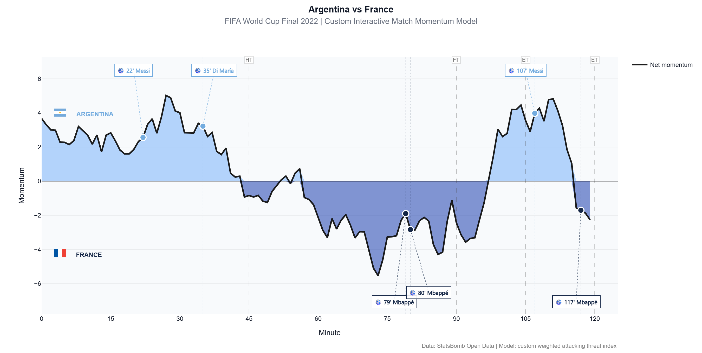

# Football Match Momentum Analysis

Interactive football match momentum analysis using StatsBomb Open Data.

This project builds a custom momentum model for the **Argentina vs France 2022 FIFA World Cup Final**, estimating which team generated more attacking threat throughout the match.

## Project Preview



> Interactive version available in: `outputs/interactive_momentum_chart.html`

## Objective

The goal of this project is to move beyond basic match statistics such as possession, total passes or shots, and create a more meaningful view of match dominance.

The model estimates attacking momentum by assigning weighted value to events that are more directly related to threat creation.

## Match Analyzed

**Argentina 3 - 3 France**  
FIFA World Cup Final 2022  
Match ID: `3869685`

## Data Source

This project uses **StatsBomb Open Data**, accessed through the `statsbombpy` Python package.

No raw data files are stored in this repository.

## Methodology

The model calculates a custom momentum score using selected event types:

- Shots
- Progressive passes
- Progressive carries
- Successful dribbles
- High recoveries
- Interceptions
- High pressures

Each event is weighted according to its attacking relevance. Higher value is assigned to actions such as high-xG shots, goals, progressive carries into dangerous zones and passes that move the ball into advanced areas.

The final momentum curve is created by:

1. Calculating event-level momentum scores.
2. Aggregating momentum by minute and team.
3. Computing net momentum: Argentina minus France.
4. Applying rolling smoothing to produce a continuous match momentum curve.
5. Visualizing goals and momentum phases in an interactive Plotly chart.

## Key Features

- Event-level football data analysis
- Custom attacking threat model
- Interactive Plotly visualization
- Goal timeline
- Smoothed momentum curve
- Reproducible notebook workflow

## Tools Used

- Python
- pandas
- numpy
- Plotly
- StatsBombPy

## Project Structure

```text
football-momentum-analysis/
├── README.md
├── requirements.txt
├── .gitignore
├── notebooks/
│   └── momentum_analysis.ipynb
├── outputs/
│   ├── interactive_momentum_chart.html
│   └── momentum_chart_preview.png
└── data/
    └── README.md
